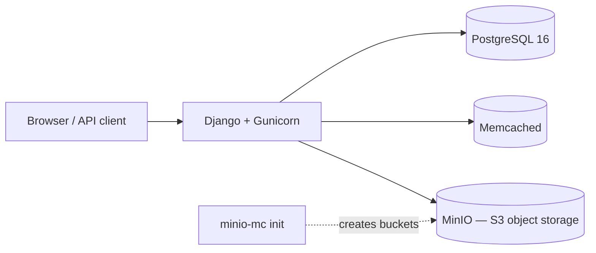

# Django Systems Learning Lab 🧱🚀

> An infrastructure-first, production-aligned Django backend foundation — containerised with Docker and built to be iterated on and extended, feature by feature.


A backend-first Django project built as a **systems learning lab**: the goal is to understand how modern web applications are structured, scaled, and tuned by building the *infrastructure layer first* — configuration, storage, caching, and delivery — before committing to heavy domain logic.

The demo surface is a small app branded **`dev[ldn]`** (landing page, explore section, and a paginated product catalogue). It exists mainly to exercise the infrastructure underneath it, not to be a finished product.

> **This is one well-reasoned approach, not a one-size-fits-all blueprint.** 
>
>
> Note: Real architectures vary with scale, domain, and constraints. The value here is in the architecture and the learning path rather than feature depth.

---

## ✅ What's implemented today

This section describes what actually runs right now. Planned work lives under **Roadmap**, separately, so there's no ambiguity between *is* and *will be*.

- **Custom authentication** — a custom `User` model keyed on email (no username), a custom `UserManager`, and a one-to-one `Profile` auto-created via a `post_save` signal. Admin is customised with an inline profile editor.
- **REST API (DRF)** — a read-only `/api/me/` endpoint exposing the authenticated user and their profile, wired through a DRF router. Auth is currently session + basic.
- **Object storage (MinIO / S3-compatible)** — three storage backends (static, public media, private media) targeting MinIO via `django-storages`, with file-extension validation on avatars and uploaded documents.
- **Caching — Memcached + stampede protection** — a Memcached backend plus a custom cache layer in `core/cache_dogpile.py` implementing dogpile (single-recomputer lock) and stale-while-revalidate strategies, applied to the product list, grid, and detail views.
- **PostgreSQL** — containerised Postgres 16 as the primary datastore (SQLite remains the bare-`base` default for quick local runs).
- **Split settings** — `config/settings/{base,dev,prod}.py` with `python-decouple` for 12-factor, environment-driven configuration.
- **Dockerised stack** — `web` (Gunicorn), `db` (Postgres), `minio` + `minio-mc` (object storage + bucket init), and `memcached`, orchestrated with Docker Compose.
- **Lightweight frontend** — server-rendered templates with an HTMX-driven paginated catalogue, used to validate asset delivery and caching behaviour.

### Tech stack (current)

| Layer | Technology |
| --- | --- |
| Backend | Django 5.2 + Django REST Framework |
| Database | PostgreSQL 16 (Docker) |
| Caching | Memcached (Docker) |
| Object storage | MinIO (Docker, S3-compatible) via django-storages |
| App server | Gunicorn |
| Static files | WhiteNoise |
| Containerisation | Docker / Docker Compose |
| Config | python-decouple (12-factor `.env`) |

---

## 🏗️ Architecture



### Apps and responsibilities

- **`config`** — project settings (split by environment), URL routing, WSGI/ASGI entrypoints, and the MinIO storage backends.
- **`core`** — base templates, landing/explore pages, the dogpile/SWR caching utilities, and HTMX helpers.
- **`accounts`** — custom user model, profile, signals, forms, admin, and the DRF serializers/viewset.
- **`products`** — catalogue models, cached views, HTMX pagination, and a `seed_products` management command for test data.

### Project structure (abridged)

```
config/            # settings (base/dev/prod), urls, wsgi/asgi, storage backends
core/              # base templates, caching utilities, landing/explore views
accounts/          # custom User, Profile, signals, DRF api/serializers, admin
products/          # catalogue models, cached views, seed command
docker-compose.yaml
Dockerfile
entrypoint.sh      # collectstatic + migrate + seed on container start
requirements.txt
```

---

## 🗺️ Project Phases

The project is built in explicit, **additive** phases — each introduces a specific backend/infrastructure concern, and once introduced a component stays part of the system unless intentionally refactored.

### Phase 1 — Foundational Backend & Configuration · ✅ Complete

Established the project foundation: environment configuration, initial app structure, and baseline dependencies. The goal was a clean, modular framework that could scale into containerisation, database integration, and later phases.

### Phase 2 — Dockerised PostgreSQL · ✅ Complete

Migrated from SQLite to a containerised **PostgreSQL 16** database via Docker, for environment consistency between local and production setups and for realistic persistence and schema evolution — replacing the default SQLite database for day-to-day work.

### Phase 3 — MinIO Object Storage (testing) + Frontend UI Layer · ✅ Complete

Introduced S3-compatible object storage (**MinIO**) as a local stand-in for a production CDN-backed service (AWS S3, Cloudflare R2, DigitalOcean Spaces). Django talks to MinIO through `django-storages` (S3Boto3), using **per-bucket storage backends** in `config/storage_backends.py` rather than a single global storage — so public and private assets carry different access policies expressed *in code*:

| Bucket | Backend | Access | URLs | Used for |
| --- | --- | --- | --- | --- |
| `static` | `MinioStaticStorageTesting` | public-read | unsigned | CSS / JS / frontend assets |
| `pubmedia` | `MinioMediaStorageTesting` | public-read | unsigned | avatars, product images |
| `prvmedia` | `MinioMediaStoragePrivateTesting` | private | **signed, time-limited** | invoices / sensitive docs |

This mirrors how production treats object storage: migrating later means swapping credentials/endpoint and attaching a CDN — with no changes to models, storage classes, or access rules.

> **Expected dev limitation:** Django generates media URLs on the internal Docker hostname `minio:9000`, which the host browser can't resolve by default — so signed/private URLs and admin media previews won't render in the browser unless you add `127.0.0.1  minio` to your hosts file. Static assets load fine (they use the `localhost:9000` custom domain). This is a local-only quirk and doesn't affect Django↔MinIO communication or production.
>
> The private `prvmedia` bucket is intentionally **created manually** (kept out of the auto-init for isolation) — create it once via the MinIO console.

📄 **Full walkthrough:** [`minio-cdn-setup.md`](./minio-cdn-setup.md) — backends, bucket policies via `mc`, the public/private access model, and production migration notes.

### Phase 4 — Caching & Concurrency Control · 🚧 In Progress

Introduced a caching layer to cut database work on public pages and to explore performance under concurrency. Rather than Django's `@cache_page`, the project uses a **custom view-level decorator** (`core/cache_dogpile.py`) backed by **Memcached**, designed to prevent cache stampede (the "dogpile" effect) when a TTL expires across multiple Gunicorn workers.

Two strategies are provided and chosen per endpoint:

| Strategy | Behaviour | Applied to |
| --- | --- | --- |
| **Short-wait** | One worker takes an atomic lock and recomputes; others poll briefly, then receive the fresh result. Strict freshness, small spike at the TTL boundary. | `product_list` (TTL 60s), `product_detail` (TTL 180s) |
| **Stale-while-revalidate (SWR)** | One worker recomputes while others are served a slightly stale copy immediately. Smooth p95, no boundary spike. | `product_grid` fragment (TTL 60s, stale grace 30s) |

Design properties (per the ADR): **fail-open** (a cache outage falls back to normal rendering), **authenticated requests bypass the shared cache** to avoid leaking user-specific content, atomic Memcached `add()` locks with a `lock_ttl` safety release, and **variant-aware cache keys** so HTMX fragments and full pages never collide.

**Why Memcached first:** start simple to *measure* caching impact with minimal moving parts before scaling the approach.

📄 **Design & verification:** [`phase_4_dogpile_adr.md`](./phase_4_dogpile_adr.md) — the full ADR covering execution flows, a worked TTL timeline, tuning parameters, failure modes, before/after behaviour, and the k6 / Memcached verification method.

**In progress — Redis + API-layer scalability.** The current focus of this phase is introducing **Redis** (better suited to production scale, with native distributed-locking patterns) and expanding the **DRF API layer** to test scalability and explore API-level caching techniques (specific strategies still being determined) beyond the existing view/page caching. The read-only `/api/me/` endpoint is the starting point for that API surface.

### Phase 5 — Cloudflare CDN (live) · ⏳ Planned

The final step in progressively **splitting the environments** — local → dev → staging/testing → production — so content and object delivery are managed appropriately at each tier. Cloudflare adds an edge/CDN layer in front of production for asset delivery, edge caching, and cache invalidation at scale — completing the path from the MinIO-based local object storage of Phase 3 to a production CDN-backed setup.

### Future phases · ⏳ Planned

Tracked in detail under [Roadmap](#-roadmap-planned-not-yet-implemented): load balancing / reverse proxy strategies, CI/CD with automated testing, performance benchmarking and profiling, staging/production parity, and observability (logging, metrics, tracing).

---

## ⚙️ Getting started (Docker)

### Prerequisites

- Docker and Docker Compose
- A `.env` file (copy from `.env.example` and fill in values)

### 1. Configure environment

```bash
cp .env.example .env
```

Then set the required variables (see **Configuration** below). At minimum you need `DJANGO_SECRET_KEY`, the `POSTGRES_*` values, the `MINIO_*` values, and `DJANGO_SETTINGS_MODULE=config.settings.dev`.

> **Note:** the `web` service's Gunicorn command expects `WORKERS`, `THREADS`, and `TIMEOUT` to be defined in `.env`. Add them (e.g. `WORKERS=3`, `THREADS=2`, `TIMEOUT=60`).

### 2. Build and run

```bash
docker compose up --build
```

On startup, `entrypoint.sh` runs `collectstatic`, applies migrations, and seeds the product catalogue automatically.

### 3. Access the services

| Service | URL |
| --- | --- |
| Django app | http://localhost:8001 |
| MinIO console | http://localhost:9001 |
| MinIO S3 API | http://localhost:9000 |
| PostgreSQL | localhost:5432 |
| Memcached | localhost:11211 |

### 4. Create an admin user

```bash
docker compose exec web python manage.py createsuperuser
```

### Running tests

```bash
docker compose exec web pytest
```

### Local (non-Docker) quick run

For a fast, dependency-light run on SQLite without containers:

```bash
pip install -r requirements.txt
DJANGO_SETTINGS_MODULE=config.settings.base python manage.py migrate
DJANGO_SETTINGS_MODULE=config.settings.base python manage.py runserver
```

> The bare `base` settings use SQLite and local filesystem storage — handy for a quick look, but Postgres/MinIO/Memcached only come online via Docker with `config.settings.dev`.

---

## 🔧 Configuration

Configuration is environment-driven via `.env` (loaded with `python-decouple`). Start from `.env.example`. Key groups:

| Group | Variables (examples) |
| --- | --- |
| Django | `DJANGO_SECRET_KEY`, `DJANGO_DEBUG_DEV`, `ALLOWED_HOSTS`, `DJANGO_SETTINGS_MODULE` |
| Gunicorn | `WORKERS`, `THREADS`, `TIMEOUT` |
| PostgreSQL | `POSTGRES_DB`, `POSTGRES_USER`, `POSTGRES_PASSWORD`, `POSTGRES_HOST`, `POSTGRES_PORT` |
| MinIO / S3 | `MINIO_*`, `AWS_S3_*` |

Never commit `.env` (it's git-ignored).

---

## 🧭 Roadmap (planned, not yet implemented)

These are explicitly **not** in the current build:

- **Environment tiers & deployment hardening** — a dedicated staging/testing tier with staging↔production parity; Gunicorn/Uvicorn + Nginx, health checks, release-time migrations, and rollback steps. *(Cloudflare, the production edge/CDN layer, is tracked as Phase 5 above.)*
- **CI/CD** — automated testing and deployment pipelines.
- **Observability** — structured logging, metrics, and tracing.
- **Load balancing / reverse proxy** strategies.
- **Payments integration (Stripe)** — a future avenue to practise integrating a payment provider in test mode as a feature/testing exercise (the `stripe` dependency is already present).

---

## 📍 Current state

The infrastructure-first foundation is in place: split settings, PostgreSQL, MinIO-backed object storage, a Memcached caching layer with stampede protection, custom auth, and a small DRF surface. The application remains intentionally light on domain features — APIs and functionality are added gradually as part of the learning and performance process.

---

## 👤 Author

Built by **TylerRTDev** — [GitHub](https://github.com/TylerRTDev)

## 📄 License

Released under the **MIT License** — free to use, modify, and distribute with attribution. See [`LICENSE`](./LICENSE) for the full text.